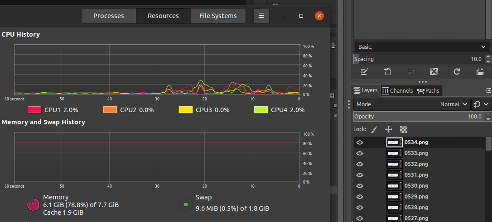
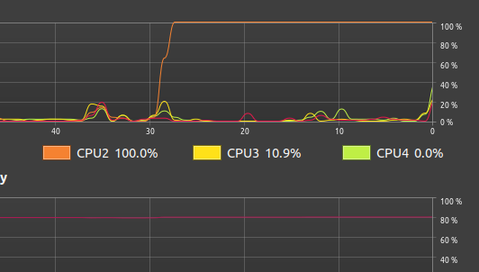

# Animation 2D

Creating and editing frame or cel animation files.

## Frame Animation

Check the animation section of [adobe-photoshop](/adobe-photoshop.md#animation)

## Creating Short GIF Recordings

This can be done with either (Photoshop) or (Blender + GIMP) to edit and export an OBS recording.

Blender + GIMP can be more efficient at handling large files.

Both are highly memory intensive. PNG files are 'lossless' quality, and each frame is loaded into memory no matter how you do this. You will crash without enough space (16+ GB RAM for only GIMP to render the GIF, no other applications running)

Recommendations:

- 1200px or smaller on the widest side
- 100 frames or less
- Photoshop: increase the speed percentage of video playback to lower the duration below 10 seconds

### Resource Requirements

This example is from a Linux VM with 4 CPU cores, and 8 GB of RAM.

- 534 frames loaded
- GIMP is the only program open

If you were to add Chrome or Firefox, you'd be out of space to work. If your job requires you ever work live on various files while screen sharing, you will need minimum 32GB RAM for animation or video editing.

## OBS Studio, Record Screen

Record Screen > File > Remux `.mkv` to `.mp4`

### Option 1: Photoshop, Render as GIF

- Open the `.mp4` file in Photoshop.
- Be sure to add `Window` > `Timeline` to your workspace if it's not already visible.
- Make any adjustments
- `File` > `Export` > `Save for Web (Legacy)...` > `Save` to create a GIF

### Option 2: Blender, GIMP, Render as GIF

`Open .mp4` -> `Blender` -> `<make edits>` -> `Output` -> `Render as PNG's` -> `GIMP/KRITA` -> `Render GIF`

## Blender

Notes adapted from here: <https://docs.blender.org/manual/en/latest/render/output/animation.html>

- Choose 'Video Editing' mode when opening Blender
- Drag and drop your video file from the folder window into the timeline
- Be sure to set the start / end frames under `Playback` > `Set Start / End Frame`
	* This setting is based on where the sequencer cursor is currently at (blue bar that moves when playing video)
- `Output` > `File Format` > `PNG` (individual frames, recommended for long renders in case of crash)
	* `Resolution` > `%` you'll want to look at this value to prevent your 100 frame 1920x1080px GIF from being 50 mb in size. 
	* `Compression` you'll want to look at this value to prevent your 100 frame 1920x1080px GIF from being 50 mb in size.
- `Output` > `File Format` > `FFmpeg Video` (mp4)
- `Render` > `Render Animation` (let it do it's thing, it's actually writing the file(s) while this is happening)

## GIMP

`Open as layers` -> `Select all PNGs` -> `Export As...` -> `file.GIF` -> `OK`

Once the files are open as layers and loaded into memory, rendering the GIF only requires CPU.

The resulting GIF will playback slower than any `.mp4` version. To fix this you'll need to adjust the time between frames in GIMP when saving.
